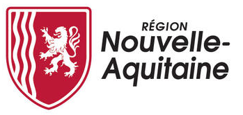

# Documentation d'administration de l'application "Méthan-Action" #

# Généralité

* Statut
  - [x] à rédiger
  - [ ] en cours de rédaction
  - [ ] relecture
  - [ ] finaliser
  - [ ] révision

Personnes qui ont des droits d'accès :

- droits administrateur :
florence.dostes@nouvelle-aquitaine.fr
julie.michels@nouvelle-aquitaine.fr
emilie.albert@nouvelle-aquitaine.fr
julien.jimenez@nouvelle-aquitaine.fr
thomas.ferenc@ademe.fr
melisa.amara@na.chambagri.fr 
annabelle.gallitre@na.chambagri.fr
sarahlynn.rizard@cuma.fr
mylene.alvarez@cuma.fr

- droits consultant : 
lickel.l@arec-na.com   = lenaïg Lickel
guillaume.dufil@ademe.fr
julien.vermeire@ademe.fr
marion.papadopoulo@nouvelle-aquitaine.fr

